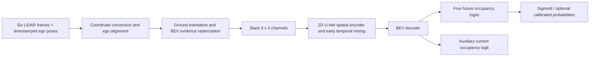

# Proposed v1 architecture

All exact sizes and hyperparameters are engineering defaults to validate. See [reference catalog](../research/references.md) for evidence and [ADRs](decisions/README.md) for decisions.

## End-to-end pipeline

Actor truth goes only to target generation and evaluation. The RGB camera goes only to demonstration panels in v1.

## Frame and grid contract

`T_A_B` maps homogeneous coordinates from B to A, using column vectors. CARLA stores x-forward, y-right, z-up coordinates. Our internal convention is right-handed x-forward, y-left, z-up. Let `S=diag(1,-1,1,1)`; convert each native point with `S` and each native transform with `S T S`. Convert points, poses, boxes and velocities once at the ingestion boundary; never negate yaw ad hoc in individual consumers. [CARLA sensors](https://carla.readthedocs.io/en/latest/ref_sensors/), [Modern Robotics](https://modernrobotics.northwestern.edu/nu-gm-book-resource/3-3-1-homogeneous-transformation-matrices/).

Define `E0` at the current ego origin with current heading but world-vertical z (yaw-only, gravity-aligned). This differs from a tilted vehicle body frame on slopes. Then:

`p_E0 = inverse(T_W_E0) T_W_Sk p_Sk`.

Use full 3D sensor poses before projecting onto the ground plane. Transform each historical sensor origin with the same chain for ray traversal. A future actor box corner `q_A` maps as:

`q_E0(h) = inverse(T_W_E0) T_W_A(t+h) q_A`.

Here `q_A` already includes the bounding-box local location/rotation; alternatively obtain world vertices from CARLA and apply `inverse(T_W_E0)`. Never substitute `E(t+h)` as target frame. No future ego pose is needed by the model.

XY range is `[-32,32) × [-32,32)` m; resolution `r=0.5`; row `i=floor((y+32)/r)`, column `j=floor((x+32)/r)`. Cell center is `(-32+(j+0.5)r, -32+(i+0.5)r)`. Tensor height indexes y; width indexes x. Render with explicit axis labels rather than silently transposing tensors. Clip polygons at the ROI; do not clamp outside points to edge cells.

## Input contract

Raw frame: `N_k × 4` float32 (`x,y,z,intensity`), measurement frame ID, simulation timestamp, sensor/world pose and ego pose. Number of points varies. Intensity is retained in raw storage but not a default network channel.

Input history offsets are `[-1,-0.8,-0.6,-0.4,-0.2,0]` seconds. Do not merge the clouds before encoding time: alignment removes ego motion but preserves actor motion. Fixed history slots encode time in the stack baseline; variable timing is rejected, not silently treated as equally spaced. Later variable-rate models need explicit time embeddings and missing-frame masks.

| Channel | Definition | Missing/empty value |
|---|---|---|
| 0: return density | `min(log1p(n_obstacle)/log1p(32),1)` | 0 |
| 1: maximum obstacle height | Above estimated local ground, clipped `[0,4]` m and divided by 4 | 0, disambiguated by hit flag |
| 2: obstacle hit | At least one non-ground return in cell | 0 |
| 3: ray traversal evidence | At least one returning ray traverses the cell before its endpoint within the designated obstacle-height slab | 0 |

Ground estimation uses only input points: begin with robust plane fitting on near-ground candidates for flat-town pilots; exclude returns below 0.2 m above estimated ground, retain obstacles through 4 m. Sloped scenes require a local ground surface or sector fit, tested before inclusion. These thresholds are tunable defaults, never simulator-semantic ground removal in the standard input pipeline.

Ray evidence is **partial observation evidence**, not a certificate of free column volume. Use 3D segment traversal (or documented height-aware segment clipping followed by 2D traversal), testing against the local `[0.2,4]` m slab. Rays overhead must not clear obstacles beneath them. Traverse original returning rays before ground-return removal; stop before endpoints, retain endpoint obstacle evidence, and never infer an unreturned beam was free. If hit and traversal coexist, preserve both evidence channels. Cells with neither are unknown/no selected evidence. Ray origins may be outside ROI after alignment: clip segments correctly. No future ray is allowed in inputs. Where the local ground/slab estimate is unsupported, leave traversal evidence absent and log the affected region; do not invent a free-space observation.

Shapes: feature tensor `[B,T=6,C=4,H=128,W=128]`; masks/targets `[B,K=4,128,128]`. The training loader may expose labels separately, but `model.forward` accepts only the feature tensor. Ground confidence and ray evidence quality are logged QA fields; adding them as channels is an experiment requiring a schema version.

## First forecast network

Stack time-major channels to `[B,24,128,128]`. Each block is two 3×3 convolutions with padding 1, GroupNorm (8 groups) and SiLU. Proposed levels:

| Stage | Output shape |
|---|---|
| Encoder 0 | `[B,32,128,128]` |
| 2× downsample + encoder 1 | `[B,64,64,64]` |
| 2× downsample + encoder 2 | `[B,128,32,32]` |
| 2× downsample + encoder 3 | `[B,256,16,16]` |
| Decoder 2, bilinear upsample + skip + block | `[B,128,32,32]` |
| Decoder 1 | `[B,64,64,64]` |
| Decoder 0 | `[B,32,128,128]` |
| 1×1 future head | `[B,4,128,128]` logits |
| 1×1 current auxiliary head | `[B,1,128,128]` logits |

Use `align_corners=False` for bilinear resize, fixed shapes, and no softmax across horizons. Each horizon is an independent Bernoulli channel. The stacked convolution mixes time immediately; there is no separate recurrent temporal block in this baseline. Spatial downsampling provides context and skip connections preserve localization, following the general [U-Net](https://arxiv.org/abs/1505.04597) design.

Inference returns four future probabilities plus optional current diagnostics, along with `anchor_timestamp`, `T_W_E0`, `resolution`, `extent`, `horizons`, `schema_version`, `model_id`, `calibration_id` and freshness status. Unknown input cells are not forced to output 0.5: prediction uses learned context. Observation masks remain available independently. The initial context overlay is measured obstacle evidence, which includes actors; it is not automatically a static-only map. A static-only layer requires separately validated motion/semantic separation or explicitly labeled simulator-only visualization, never hidden oracle inputs.

The input alone occupies 1.5 MiB/sample in float32 (`6×4×128×128×4` bytes). Four output logits occupy 0.25 MiB/sample. These are not total memory estimates: activations, gradients, optimizer states and convolution workspaces dominate training. Start batch size 4, then measure; halve widths if required. No GPU capability is assumed.

## Current occupancy and baselines

Before forecasting, train the same family of U-Net on `[B,4,128,128]` for current actor occupancy. This is a current-time actor segmentation task, not a promise to learn static world geometry. Repeat its output over horizons for a sensor-only learned persistence baseline. Use an equivalent single-frame four-horizon forecaster to isolate the value of history.

## Temporal alternatives

| Approach | Benefit | Cost / weakness | Decision |
|---|---|---|---|
| Stack + U-Net | Simple, fixed-window, parallel inference | Tied to input order/length; no explicit memory | v1 default |
| Shared encoder + temporal 1D/3D convolutions | Reuses per-frame spatial features; efficient multiscale fusion | Fixed receptive window | First lightweight challenger, inspired by MotionNet |
| Shared encoder + ConvGRU | Gated spatial memory; natural temporal updates | Sequential training/inference; state alignment concerns | Main v1.1 challenger |
| ConvLSTM | Separate cell/hidden state | More gates/state than GRU | Compare if GRU cannot preserve occluded evidence |
| Bottleneck temporal attention | Flexible context selection | More data/compute; positional and causal masking | Later measured experiment |
| Full dense spatiotemporal attention | Broad associations | Six 128² maps mean 98,304 tokens; ~9.7 billion pair scores/head | Exclude at full resolution |
| Learned pillars / sparse voxels | Richer height and point geometry | Custom data processing and backend burden | Later encoder ablation |
| Camera lift/splat or BEVFormer-style fusion | Appearance and semantic cues | Depth/calibration and multimodal training burden | After LiDAR evidence |
| 3D occupancy world model | Vertical structure and long rollout | New labels, tokenization, larger benchmark scope | Separate research branch |

ConvGRU challenger: shared encoder outputs `[B,6,128,32,32]`; 3×3 ConvGRU with hidden width 128 processes oldest to newest; final hidden state and current-frame 64/32-channel skips decode to the same heads. Zero-initialize state per training/inference window for the first comparison. Do not persist hidden state across anchors without ego warping and a reset protocol. GRU gating follows `z=sigmoid(Wz*[x,h])`, `r=sigmoid(Wr*[x,h])`, `h_new=(1-z)*h+z*tanh(Wh*[x,r*h])`. This is our proposed adaptation, not an exact FIERY reproduction.

## Targets and losses

Future binary actor union labels and validity masks come from the [dataset contract](dataset-strategy.md). Default:

`L_future = mean_h( sum_i,j M_h * BCEWithLogits(z_h,Y_h) / sum_i,j M_h )`.

Skip a horizon with no valid cells and report its count; fail a batch with no valid supervision. Add `0.25 * L_current` as proposed auxiliary supervision; ablate coefficient 0 versus 0.25. All four future horizons receive equal weight. Use numerically stable logits loss, with no sigmoid before training loss. Start AdamW at `lr=3e-4`, weight decay `1e-4`, batch 4, up to 50 epochs, validation each epoch, patience 10 using mean future validation NLL. These are starting settings, not literature-derived optimal values. Check small-set overfit before tuning.

For positive weight `w`, weighted BCE minimizes at `q*=wp/(wp+1-p)`, not `p`; a fixed logit offset can undo the idealized weight shift but is not a general calibration guarantee. Therefore report raw probability scores and validation-fitted calibration for weighted/focal variants. Dice/IoU surrogates can help spatial overlap but are not proper probability scores; keep BCE as an anchor loss.

Later flow head: `[B,4,2,128,128]`, in meters, with an explicit convention. Proposed backward displacement at future footprint cell q is `q_at_t0 - q_at_h`, derived via actor-local rigid correspondence in E0. Mask births, unsupported correspondences, overlaps and source-outside-ROI cells. Penalize valid vectors with Smooth L1 and evaluate endpoint error. This differs from Cam4DOcc's backward-to-center flow. Do not transplant losses between flow conventions. Direct occupancy remains necessary for actors without a source at t0.

## Uncertainty and planning interface

Sigmoid outputs represent cell marginals; wider maps may reflect uncertain motion or poor localization. Evaluate calibration; an uncertainty-colored visualization alone proves neither. Ensembles probe model disagreement; conditional latent futures can represent correlated modes but require separate sample-based evaluation. Both are experimental.

If scoring a trajectory later, transform its time-indexed footprint into E0, query matching horizons, and treat summed occupied probabilities as expected overlap cost. `1-product(1-p)` needs an independence assumption and is not a calibrated collision probability. Four sparse horizons can miss between-horizon collisions; denser forecasts or swept-volume checks are required for planning experiments. No policy conditioning is present in v1, so forecasts cannot be assumed valid under arbitrary new ego actions.
